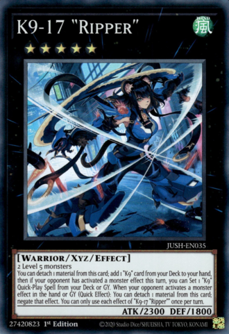
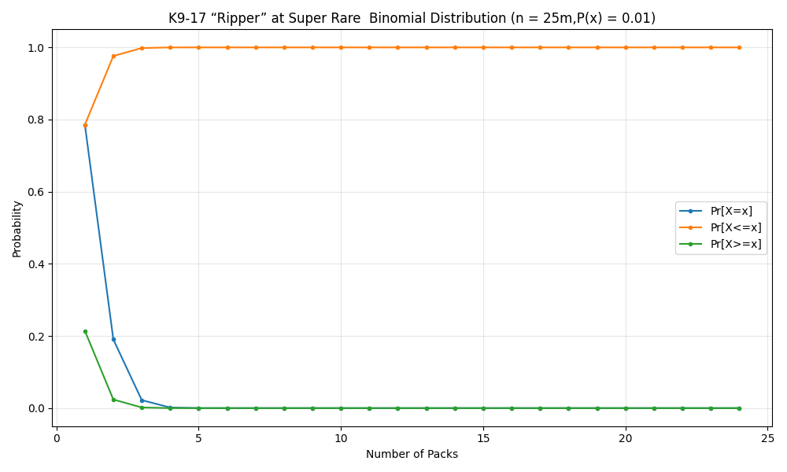
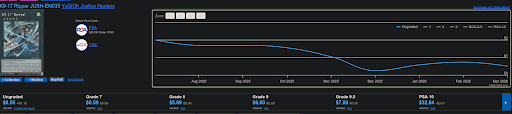

# Hot Singles in your Pack: An Analysis of Yu-Gi-Oh Card Probabilities Using Binomial Probability (v1 March 2026)

## 

Recently I've made the grave mistake of getting into playing Yu-Gi-Oh. And it all started from buying a simple box of one of the latest sets of 2025 *Justice Hunters*, and I wanted to build a deck using the set's newest Arctypes, K9 a really cool detective themed archtype but these cards aren't always guarenteed. The rates as specified by Konami for this archetype are typically *Secret Rares*. This leads to the issue, do I spend my time buying packs opening them and seeing if I pull more K9 cards for my deck,
or do I buy singles? How many packs would I have to open to get a specific card vs just buying it online?

## The Hunters for Justice (And some Yummy Cats)

The main set of discussion is *Justice Hunters* released by Konami in the US on 8/1/2025 and features over 60 cards with 40 Monster cards in total. Featuring the newest archetypes "Dracotail","K9" and the "Yummy"
The following rarity stats are given as below:

As we can see with ten Ultra Rares (UR) and ten Super Rares (SR) we are working with about twenty cards we are inerested at that can be considered "above rare" since the core K9 cards we care about in this set (K9-17 "Ripper" for example) is printed only at Super and Collector's rare rarities.

In addition we know a bit more about each booster pack we buy, as the first six cards of any pack will be printed at Rare rarity and only the seventh card in the pack will be printed at above Rare in rarity. This just makes the hunt for the cards we want even harder

## A Case for K9: What are we trying to do here?

Assuming an equally randomly distributed pack, if the initial six cards are guaranteed to be at rare rarity with the final card being at or above Super Rare rarity, what are the odds of being able to pull a specific card at a given rarity roughly estimate how many packs it would take to reasonably pull that specific card and doing a cost benefit analysis between pulling more packs or buying a single?

## Catching a Scent: Choosing a Method
In order to evaluate this question I needed some way to model the situation. I open a pack, either I pull the card I've been looking for or I do not. It is a 
binary success or failure.  These packs are also independent of each other[^1]. And the probability of getting a card above Rare in rarity doesn't change. These are the perfect conditions that met using what is called a **Binomial Distribution**. 

A Binomial Distribution is the probability distribution of the number of successes in a sequence of independent events that can only have the chances of passing or failing. Essentially, it's the disribution of the amount of successes given a fixed amount of trials and can be represented by the formula:

$`B(k,n,p) = \Pr(X = k) = \binom{n}{k}p^k(1-p)^{n-k}`$

for $`{{k{{=}} 0, 1, 2, ..., n}}`$

Using n as the number of packs we open and k being the number of succesess we can evaluate the probability of pulling a specifc card at a specific rarity above Rare

But the problem now is to calculate the probability in general, as well as specify what above rare really means 

## How Rare is a Rare? 

Okay there are a lot of rarities in Yu-Gi-Oh, like a lot a lot, as in well over 40+ rarities. We can spend a lot of time discussing and talking about rarities that will simply not happen here ( But you can go [here](https://www.yugiohcardguide.com/guide_to_card_rarity.html) to read about all the rarities and the unique vartients and even some US only printings as well as [watch this](https://www.youtube.com/watch?v=vZ_jgMZGHoU) for additional explanations) 
And for this write-up, they don't matter. 

We just need to understand a rarity is simply a card that is printed at less often than other cards which makes them rare. But the issue is the information online about the rates these cards are printed at is inconsitent no one online seems to be able to coroborate each other's numbeers (sometimes you will have to scour Byzinte era fourms for some guy's "trust me bro" ratios) and the numbers are at best estimates by fans. 
 
But for our concerns there are only five rarities that are of any note as this set only has five rarities and they are and at the ratios (cards/booster pack):
- Rare (1:1)
- Super Rare (1:5)
- Ultra Rare (1:6)
- Collector's Rare (1:84)
- Starlight Rare (1:576)

## Following the Trail : Calculating Probabilities 
### Assumptions 

-  Assume Konami did not short print any cards to effect the rarity distribution (let’s act like they’re nice for once)
-  Each Pack contains unique cards, there are no duplicates 
-  Card 7 is guaranteed to be above rare in rarity 
- Each card in the set of possible cards has an equal likelihood of being in a pack (we do not know how Konami prints cards for each pack) 
- All rarities above rare (Super, Ultra, Starlight and collectors) will be considered under the same group of "above rare rarity" (There are no unique cards printed above Ultra rare, only variants)

### Case One: Trivial Case
The most trivial probability calculation is simply finding the odds of pulling a specific card at above rare odds which is the following formula 

$`P(x) = \frac{1}{20}`$

Where 1/20 is the odds of pulling from one of the twenty above Rare rarity cards 
This is incredibly boring as we already know this via the set information Konami gave but it's a usueful baseline
### Case Two: Probability with a given rarity
Since we are looking for cards that appear at a certain rarity the probability can be found using the above given ratios of rarities with:
$`P(x) = \frac{1}{20}R`$

Where R is the given rarity of the card (Super, Ultra,Collector's,etc)

So let's use this to map out the probability distribution for a specific card I want. Let's use K9-17 "Ripper" at Super Rare rarity for the rest of these calculations

### Example Calculation: Odds of pulling K9-17 “Ripper” at Super Rarity from a single pack

$`P(x) = \frac{1}{20} * \frac{1}{5} = \frac{1}{100} = 0.01 = 1\%`$

Now what we have the probability for a single pack let's use the Binomial Distribution to simulate opening multiple packs. In this case let's use a n = 24 since that's as many packs as you would get in a box

### Probability for pulling a single K9-17 “Ripper” at Super Rare from a single pack Repeatedly
In this instance let’s simulate if I had bought a bunch of packs and started opening. How likely is it for me to pull K9-17 “Ripper” at least once?
$`B(k,n,p) = B(1,24,P(x)) = 0.1904 = 19\% `$

And here is the probability distribuion as well for other possible successes 

| X | Pr[X = x] | Cumulative Pr[X ≤ x] | Pr[X > x] |
|---|-----------|----------------------|-----------|
| 0 | 0.78567815 | 0.78567815 | 0.21432187 |
| 1 | 0.19046743 | 0.97614557 | 0.02385443 |
| 2 | 0.022125004 | 0.9982706 | 0.0017294268 |
| 3 | 0.0016388892 | 0.99990946 | 0.000090537644 |
| 4 | 0.00008691079 | 0.99999636 | 0.0000036268505 |
| 5 | 0.0000035115472 | 0.9999999 | 0.000000115303436 |
| 6 | 0.00000011232221 | 1 | 0.0000000029812242 |
| 7 | 0.00000000291746 | 1 | 0.000000000063763994 |
| 8 | 0.00000000006262225 | 1 | 0.0000000000011417534 |
| 9 | 0.0000000000011245297 | 1 | 0.000000000000017208457 |
| 10 | 0.000000000000017038329 | 1 | 0.0000000000000002220446 |
| 11 | 0.00000000000000021904189 | 1 | 0.0000000000000001110223 |
| 12 | 0.000000000000000002396923 | 1 | 0.0000000000000001110223 |
| 13 | 0.000000000000000000022348932 | 1 | 0.0000000000000001110223 |
| 14 | 0.00000000000000000000017737247 | 1 | 0.0000000000000001110223 |
| 15 | 0.0000000000000000000000011944274 | 1 | 0.0000000000000001110223 |
| 16 | 0.0000000000000000000000000067865195 | 1 | 0.0000000000000001110223 |
| 17 | 0.000000000000000000000000000032259155 | 1 | 0.0000000000000001110223 |
| 18 | 0.00000000000000000000000000000012671947 | 1 | 0.0000000000000001110223 |
| 19 | 0.0000000000000000000000000000000004042088 | 1 | 0.0000000000000001110223 |
| 20 | 0.0000000000000000000000000000000000010207293 | 1 | 0.0000000000000001110223 |
| 21 | 0.000000000000000000000000000000000000001963885 | 1 | 0.0000000000000001110223 |
| 22 | 0.000000000000000000000000000000000000000002705 | 1 | 0.0000000000000001110223 |
| 23 | 0.000000000000000000000000000000000000000000003 | 1 | 0.0000000000000001110223 |

## Final Verdict 
Now that we know there is an aproximately 19% chance of pulling the card from 24 packs, let's see how much it would cost to buy the card online and do a comparison.

Considering a box of Justice Hunters is currently $44.99 MSRP and according to our calculations a box has at least a 20% chance of possibly opening one (or four) vs the price of an ungraded. 

It’s a complete waste of time and money to try and pull packs for this card. If you pay for a box to pull for her, you have overpaid for her by over 115%, just buy a single 

Yes it's obvious from the start that this is a waste of money, however sometimes it is nice to see **just** how much of a waste these things can be.

[^1]: This only applies to individual packs, not boxes as boxes have fixed rates. You will always pull at least two Secret Rares from a box. But let's ignore them for this line of questioning. 
### Sources 
https://en.wikipedia.org/wiki/Binomial_distribution
https://www.yugiohcardguide.com/guide_to_card_rarity.html
https://www.db.yugioh-card.com/yugiohdb/
